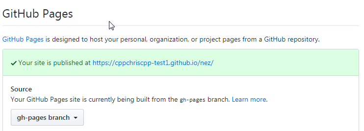

# Nez
This is a web-based NES emulator. It has been forked from 
<a href="https://github.com/sumez">Sumez</a>'s 
<a href="https://github.com/sumez/nez">Nez emulator</a> to support a few new features, and also to make it as easy 
as possible for individual developers to create a web-facing emulator for their games.

**All updates to this live in the `hackery` branch.** 
The `master` branch will be kept up to date with the `Sumez/nez` `master` branch.

# Setting up the emulator

You have a number of options for setting up the emulator - all detailed below. 
Pick whichever one is easiest for you!

You can get the files you need by clicking the `Download Zip` button on Github. (likely a green button at the top right)

## Setting it up using a PHP web server/host

 Copy all of the files from the top-level nez folder to your webserver. That's all - this is one of the simplest 
 options.

 Navigate to it on the web, and you should see Nez.
 
## Setting it up using plain html (Suitable for most web hosts, including amazon s3)

If you don't have (or want) PHP support, you can set the emulator up without it.

Instead of copying all files from the repository to your server, open the `dist` 
folder. Copy all of the files from the `dist` folder to your web server. 

## Setting it up using github pages

If you fork this version of `Nez` on Github, you can use it to play your own game. This requires a tiny bit more
work than the other options, but works just as well.

How to do it: 
1. Fork the `Nez` repository from [cppchriscpp's github](https://github.com/cppchriscpp/nez) to your own account.
2. Make a change to `readme.md` and save/commit it. (This works around a github quirk and publishes the site for you.)
3. Go to the `settings` tab on your repository, then to `Branches` and change the default branch to `gh-pages`. 
   
4. Check your site to make sure it is up and working. You can find the url under the `Settings` tab, under `Options`.
   

**Important**: Any changes you make to configuration **must be on the `gh-pages` branch**. 
Changing other branches will not work.

# Setting Nez up to automatically play your game

Once you have set up Nez hosted somewhere, you can set it up to start your game automatically!

All you need to do is edit a configuration file called `config.js` - it should be in the same folder as `index.php` or
`index.html`. (Whichever one you set up above) 

There is a setting called `game` which you can point to rom file to load. There are a few ways you can set it. Pick
either of the options below for details.

## Hosting the rom with the emulator

The easiest way to get things running is to copy your rom to the same folder as `index.php` or `index.html`. After you
do this, you just need to update `config.js` to point to this file, which you can do like this:

```javascript
    game: "my_game.nes",
```

## Hosting the rom somewhere else

If you want to play a game that is hosted on another server, you can also provide a full url to the rom. 

<strong>NOTE</strong>: The server hosting the rom must be properly set up with CORS headers. If this is not done, the
rom will not load, and there will be an error in the javascript console.

Once you have the url to the game, update `config.js` with your rom's url:

```javascript
    game: "https://my-site.com/folder/rom.nes",
```

# Embedding Nez on another website

Nez can be embedded into websites, allowing people to play your game right on the site! 

The easiest way to do this is with an iframe. There is a special file called `index_embed.html` or `index_embed.php`,
which is built to support this. If you open it in your browser, you will see the emulator on a plain black page.

You will want to size the iframe carefully (using css) to make sure the game looks right. The emulator can scale 
to a few sizes - the most popular one is `512px` by `480px`. 

Note that audio on ios devices is NOT supported using the embedding method. (It is supported on the regular site.)

# Adding a description of the game

Nez allows you to show some information about the game below the emulator. To do
this, update `config.js`. There are two variables you need to tweak: 

```javascript
    // Set this to a text string to show a description about your game (not shown in embedded view)
    // This will show up between the controls and the emulator description. Html is supported!
    // IMPORTANT: If you set this, be sure to set the title below too!
    gameDescription: "This is a game about doing stuff. You do stuff, and you do things. At the end, the things are done. Learn more <a href=\"http://mywebsite.com\">here</a>.",

    // Set this to the title of your game, and it will show up instead of the words "This Game" in the description area.
    gameTitle: "My Game",
```

This should result in something like this:


# It doesn't work! Help!

If you're having trouble, feel free to either open a github issue, or 
[contact me on twitter](https://twitter.com/cppchriscpp)!

# Advanced Stuff

## Building the `dist` folder manually

The `dist` folder is automatically re-generated on the `hackery` branch with every commit, so you should not ever need
to do this, unless you are working with it locally.

If you want to rebuild the `dist` directory, you can run either `build_dist.sh` (Linux and Mac) or 
`build_dist.bat` (Windows) - this script requires that you have PHP installed and on your path. 

## Starting games from javascript

If you have an iframe embedded on the same site as Nez is hosted, or you build Nez directly into your website 
(possible, but not actively supported)  you can start a game using a javascript function instead.

You can use either of the following: 

```javascript
// Start a rom from a web-based url. This can be a relative path if your game is on the same server.
window.emu.startFromUrl('https://website.com/rom.nes');

// Start a rom file using the result from the onchange event of a file input
window.emu.startFromFile(event.files[0]);
```

Make sure the emulator has fully loaded before running this - you may have to put it in a setTimeout, or something
similar.